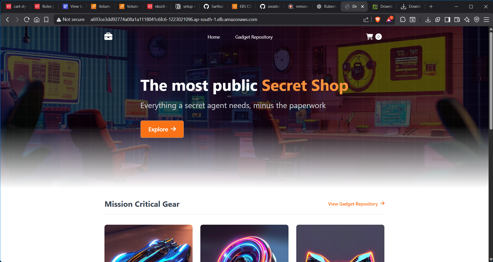
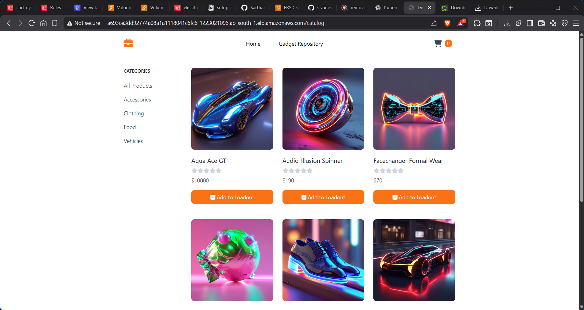
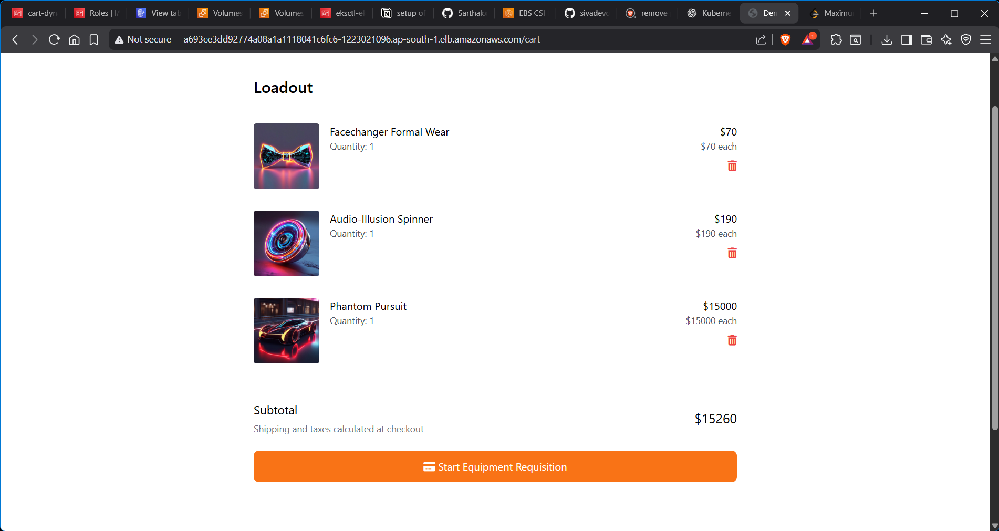
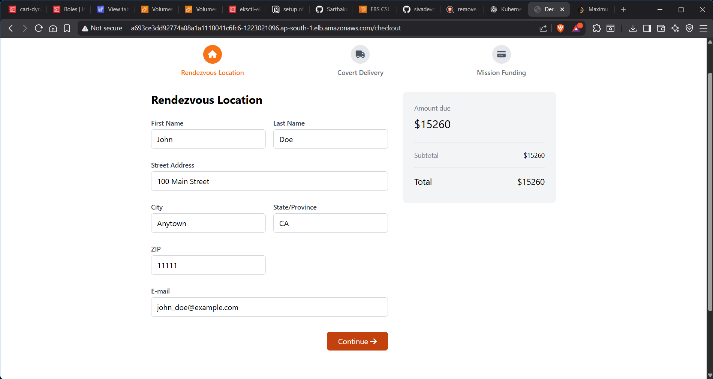
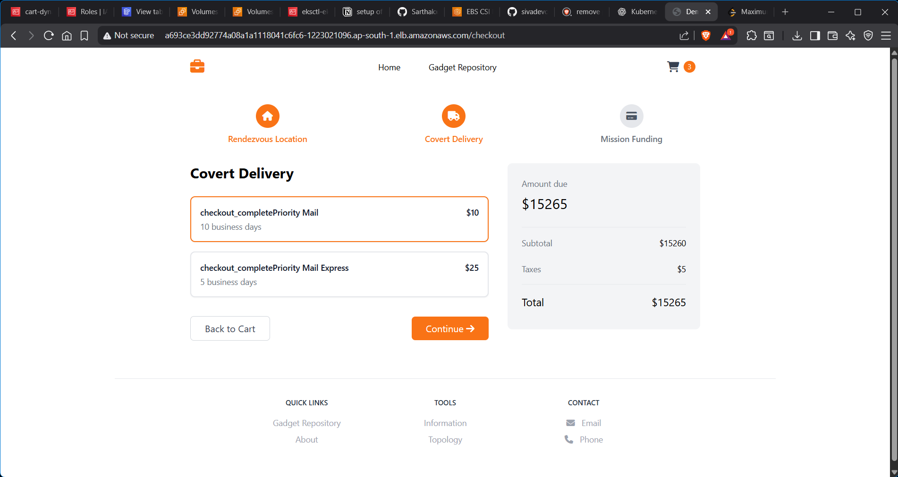
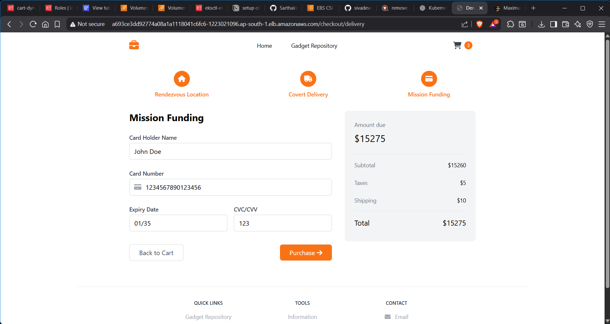
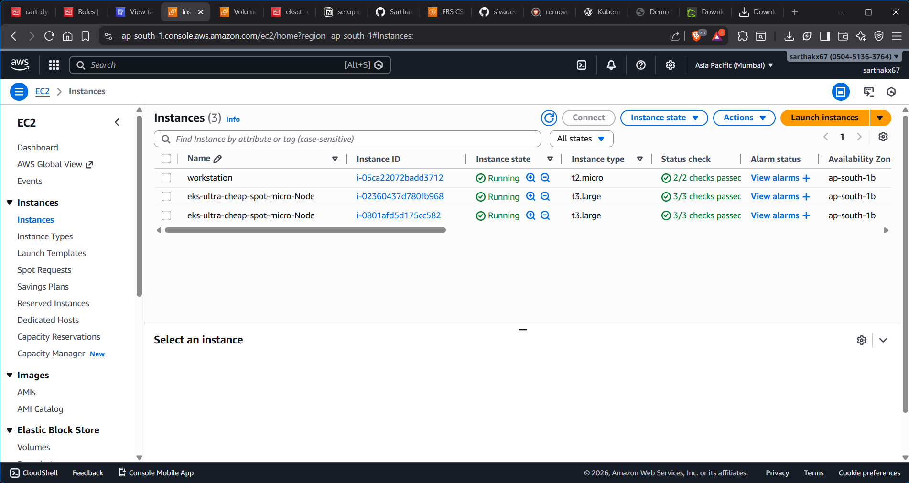
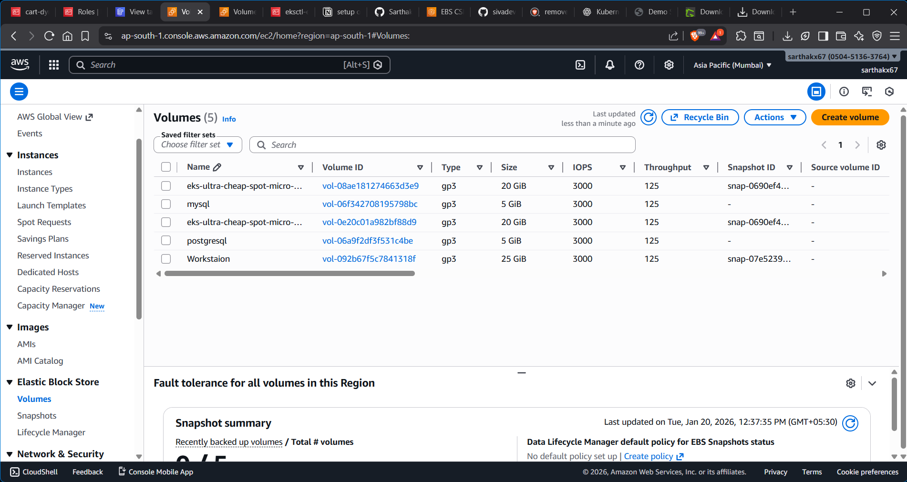
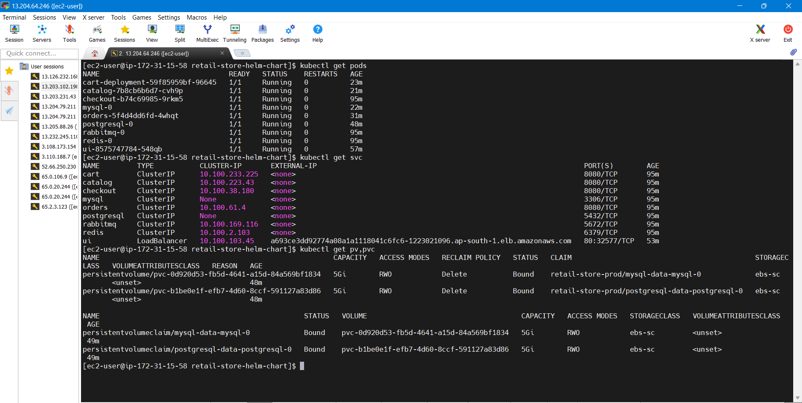
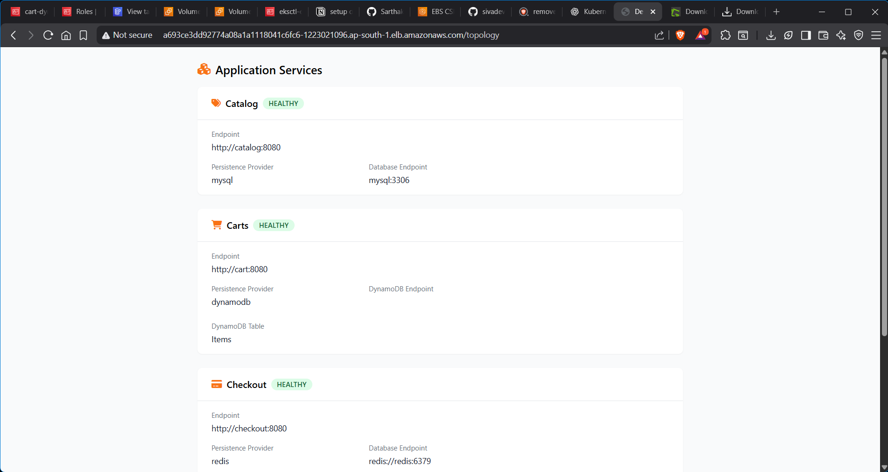

<div align="center">


### Cloud-Native Microservices Platform | DevOps Portfolio Project

> ## 🏅 Linux Foundation Certified Kubernetes Administrator (CKA)

<p align="center">
  
</p>

<p align="center">
  
  
  
  
</p>

<p align="center">
  
  
  
  
  
</p>

<p align="center">
  <a href="#what-i-built">What I Built</a> •
  <a href="#architecture">Architecture</a> •
  <a href="#application-walkthrough">Live App</a> •
  <a href="#gitops-pipeline">GitOps</a> •
  <a href="#security--secrets">Security</a> •
  <a href="#roadmap">Roadmap</a> •
  <a href="SETUP.md"><strong>📖 Full Setup Guide →</strong></a>
</p>

</div>

---

## What I Built

A production-grade deployment of a 10-service retail store platform on AWS EKS. It goes beyond a working demo — every architectural choice below is documented and justified, showing not just *what* was built, but *why*.

**10 services across 2 layers:**
- **5 application microservices** — UI, Cart (Java), Catalog (Go), Checkout (Node.js), Orders (Java)
- **5 data services** — MySQL, PostgreSQL, Redis, RabbitMQ, DynamoDB (local for dev / AWS for prod)

<br>

<div align="center">
  
</div>

---

## Highlights

- 🚀 **Full AWS infrastructure** — VPC, EKS, IAM provisioned from scratch via Terraform
- 🔄 **GitOps deployment** — ArgoCD auto-syncs every Git push to the cluster
- 🔐 **IRSA authentication** — Cart accesses DynamoDB with zero static AWS credentials
- 📦 **Umbrella Helm chart** — 10 subcharts with layered dev/prod values
- 📈 **Horizontal Pod Autoscaling** — HPA configured for all 5 application services
- ❤️ **Health probes** — Startup, liveness, and readiness probes reduced deployment recovery from **12 min → 1.5 min**
- 📊 **Observability** — Prometheus + Grafana with custom ServiceMonitors
- ⏳ **Init containers** — Catalog waits for real MySQL readiness before startup
- 💾 **Persistent storage** — EBS-backed StatefulSets for all databases
- ⚙️ **Reusable CI** — Jenkins Shared Library with one 8-line Jenkinsfile per service

---

## Architecture

```
Internet
    ↓
Route53 (stallions.space)
    ↓
Application Load Balancer
    ↓
EKS Cluster (retail-store-prod namespace)
    ├── UI Service (Java/Spring Boot)
    │   ├── → Catalog (Go)  → MySQL (StatefulSet + EBS)
    │   ├── → Cart (Java)   → DynamoDB (via IRSA)
    │   ├── → Orders (Java) → PostgreSQL (StatefulSet + EBS)
    │   │                   → RabbitMQ (StatefulSet)
    │   └── → Checkout (Node.js) → Redis (StatefulSet)
    │
    └── Monitoring Namespace
        ├── Prometheus (scrapes all services via ServiceMonitors)
        └── Grafana (custom retail store dashboard)
```

### Key Design Decisions

| Decision | Why |
|---|---|
| Headless service for MySQL and PostgreSQL | StatefulSet pods need stable DNS identity for a replication-ready setup |
| `tcpSocket` readiness for Catalog | Go service has no Spring Actuator — port binding is a sufficient signal once the init container guarantees MySQL is actually ready |
| `httpGet /actuator/health/readiness` for Java services | Spring Actuator checks all dependencies (DB, messaging) before returning 200 — prevents traffic routing to pods that are up but not connected |
| Init container for Catalog | `mysqladmin ping` confirms real MySQL readiness, not just an open TCP socket |
| `ignoreDifferences` on `/spec/replicas` in ArgoCD | Prevents ArgoCD from fighting the HPA over replica count under load |
| IRSA for Cart | Eliminates static AWS credentials entirely — IAM role bound to a Kubernetes ServiceAccount via OIDC |

---

## Application Walkthrough

<div align="center">

<table>
<tr>
<td width="50%">
<br>
<sub><strong>1. Home Page</strong><br>Product listing served by the UI service</sub>
</td>
<td width="50%">
<br>
<sub><strong>2. Product Catalog</strong><br>Go service reading product data from MySQL</sub>
</td>
</tr>
<tr>
<td width="50%">
<br>
<sub><strong>3. Shopping Cart</strong><br>Java service writing cart items to DynamoDB via IRSA</sub>
</td>
<td width="50%">
<br>
<sub><strong>4. Checkout — Shipping</strong><br>Node.js service, step 1 of the checkout flow</sub>
</td>
</tr>
<tr>
<td width="50%">
<br>
<sub><strong>5. Checkout — Payment</strong><br>Step 2, payment details captured</sub>
</td>
<td width="50%">
<br>
<sub><strong>6. Checkout — Confirmation</strong><br>Step 3, order placed successfully</sub>
</td>
</tr>
<tr>
<td colspan="2" align="center">
<br>
<sub><strong>7. Order History</strong><br>Java service persisting orders to PostgreSQL and publishing an event to RabbitMQ</sub>
</td>
</tr>
</table>

</div>

---

## GitOps Pipeline

```
Git Push
    ↓
Jenkins (CI only)
  - Detect version from Maven / Go / Node.js
  - Build Docker image
  - Push to DockerHub
    ↓
ArgoCD (CD — watches Git every 3 minutes)
  - Detects commit
  - Renders umbrella Helm chart
  - Applies diff to cluster
  - prune: true      → removes deleted resources
  - selfHeal: true   → reverts manual kubectl changes
```

```yaml
# ArgoCD Application config
ignoreDifferences:
- group: apps
  kind: Deployment
  jsonPointers:
  - /spec/replicas    # HPA owns this field, not Git
```

---

## Infrastructure

<div align="center">
<table>
<tr>
<td width="50%">
<br>
<sub align="center">EKS worker nodes provisioned via Terraform</sub>
</td>
<td width="50%">
<br>
<sub>EBS-backed persistent volumes per StatefulSet</sub>
</td>
</tr>
</table>
</div>

### Kubernetes Resources — Live Cluster State

<div align="center">

<br><sub>Pods, Services, PersistentVolumes, and PersistentVolumeClaims across the namespace</sub>
</div>

<br>

<div align="center">
<table>
<tr>
<td width="50%">
<br>
<sub align="center">All application Services exposed</sub>
</td>
<td width="50%">
<br>
<sub>Service detail — endpoints and selectors</sub>
</td>
</tr>
</table>
</div>

---

## Health Probe Design

Probes cut deployment time from 12 minutes to 1.5 minutes by eliminating manual intervention after dependency failures.

| Service | Startup | Liveness | Readiness | Why |
|---|---|---|---|---|
| Cart, Orders, UI (Java) | `httpGet /actuator/health/liveness` | Same | `httpGet /actuator/health/readiness` | Spring checks all dependencies before returning 200 |
| Catalog (Go) | `httpGet /health` | Same | `tcpSocket :8080` | No Spring Actuator; init container already handles the MySQL wait |
| Checkout (Node.js) | `httpGet /health` | Same | `tcpSocket :8080` | Lightweight — port binding is a sufficient signal |

---

## IRSA — Secretless AWS Access

The Cart service accesses DynamoDB without any AWS credentials stored anywhere in the cluster.

```
Cart pod starts
    ↓
EKS injects AWS_ROLE_ARN + AWS_WEB_IDENTITY_TOKEN_FILE (JWT)
    ↓
AWS SDK calls sts:AssumeRoleWithWebIdentity
    ↓
EKS OIDC provider validates the JWT
    ↓
STS returns temporary credentials (auto-rotating, 1-hour TTL)
    ↓
DynamoDB access granted — zero static credentials
```

The IAM trust policy binds the role to exactly one ServiceAccount in one namespace, keeping the blast radius minimal.

---

## Monitoring

**Four panels tracking production health:**

| Panel | Query | What It Catches |
|---|---|---|
| 5xx error rate | `rate(http_server_requests_seconds_count{status=~"5.."}[1m])` | Application crashes, DynamoDB failures |
| CPU usage | `process_cpu_usage` | Runaway processes, traffic spikes |
| JVM heap memory | `jvm_memory_used_bytes` | Memory leaks (sawtooth pattern = leak) |
| Requests per second | `rate(http_server_requests_seconds_count[1m])` | Traffic baseline, anomaly detection |

ServiceMonitors scrape all 5 application services on 15-second intervals.

---

## Security & Secrets

| Area | Current State | Target |
|---|---|---|
| Application secrets | Stored in Helm values files (not encrypted at rest in Git) | External Secrets Operator pulling from AWS SSM Parameter Store, injected at runtime |
| AWS credentials (Cart → DynamoDB) | ✅ Already secretless via IRSA | — |
| Network segmentation | NetworkPolicies not yet applied between namespaces/services | Default-deny baseline + explicit allow rules per service |
| CI/CD credentials | Managed in Jenkins credential store | No change planned — out of cluster scope |

IRSA proves the pattern works end-to-end for one service. The next step is extending the same "no static secrets" principle to the rest of the application config.

---

## Key Learnings

Real problems hit and fixed — not hypothetical:

| Problem | Root Cause | Fix |
|---|---|---|
| ArgoCD blocking full sync | ServiceMonitor CRD missing — one invalid resource aborted the entire sync | Install `kube-prometheus-stack` before syncing dependent apps |
| ArgoCD vs HPA infinite fight | ArgoCD reverted HPA scaling decisions within 3 minutes of every scale event | `ignoreDifferences` on `/spec/replicas` — formally hands ownership to the HPA |
| Helm targeting the wrong cluster context | `KUBECONFIG` was set in `.bashrc` for `ec2-user`, but the bootstrap script ran as root | `export KUBECONFIG` inside the script itself, not just the shell profile |
| Catalog CrashLoopBackOff on cold start | MySQL's port 3306 opens before initialization completes — `nc -z` returns success too early | Switched init container check to `mysqladmin ping`, which confirms real readiness |
| Second Cart pod not scheduling | CPU requests set to 200m but observed usage was ~3m — scheduler saw the node as full | Set requests from observed usage × 1.5 instead of template defaults |

---

## Roadmap

**Near-term:**
- External Secrets Operator + AWS SSM for all application secrets
- Default-deny NetworkPolicies with explicit per-service allow rules
- Jenkins updates Git only; ArgoCD becomes the sole deployment path
- PodDisruptionBudgets on all StatefulSets and Deployments

**Later:**
- AlertManager rules wired to the existing Prometheus metrics
- Chaos testing on node drains and pod evictions
- Multi-environment promotion (dev → staging → prod) via ArgoCD ApplicationSets

---

## Tech Stack

<div align="center">
<table>
<tr>
<td align="center" width="16%">

<br><strong>AWS</strong>
<br><sub>EKS, VPC, IAM, DynamoDB, EBS, Route53, SSM</sub>
</td>
<td align="center" width="16%">

<br><strong>Kubernetes</strong>
<br><sub>v1.28+ — EKS managed</sub>
</td>
<td align="center" width="16%">

<br><strong>Terraform</strong>
<br><sub>VPC, EKS, IAM, SSM modules</sub>
</td>
<td align="center" width="16%">

<br><strong>Docker</strong>
<br><sub>Multi-stage builds</sub>
</td>
<td align="center" width="16%">

<br><strong>Jenkins</strong>
<br><sub>Shared library CI</sub>
</td>
<td align="center" width="16%">

<br><strong>Prometheus</strong>
<br><sub>+ Grafana dashboards</sub>
</td>
</tr>
</table>

<br>

**Application services:** Java (Spring Boot) · Go · Node.js
**Databases:** MySQL · PostgreSQL · Redis · RabbitMQ · DynamoDB
**GitOps:** ArgoCD · Helm umbrella chart · layered values files

</div>

---

## Project Structure

<details>
<summary><strong>Click to expand full directory tree</strong></summary>

```
.
├── retail-store-helm-chart/              # Umbrella Helm chart
│   ├── Chart.yaml                        # 10 subchart dependencies
│   ├── values.yaml                       # Base defaults
│   ├── charts/                           # 10 subcharts (cart, catalog, checkout...)
│   └── values/
│       ├── dev/values-dev.yaml           # Dev overrides (local DynamoDB, NodePort)
│       └── prod/values-prod.yaml         # Prod overrides (IRSA, LoadBalancer, EBS)
│
├── argocd-deployment/                    # ArgoCD Application manifests
│   ├── retail-store-app-dev.yaml
│   └── retail-store-app-prod.yaml
│
├── retail-store-Jenkins-shared-library/  # Groovy shared library
│   ├── detectVersion.groovy              # Maven / Go / Node.js version detection
│   ├── dockerBuildPush.groovy            # Build + push to DockerHub
│   ├── deployK8s.groovy                  # Helm deploy (migrating to Git-update model)
│   └── microservicePipeline.groovy       # Single-call pipeline definition
│
├── src/                                  # Dockerfiles for all 5 services
└── SETUP.md                              # Complete deployment guide, ordered steps
```

</details>

---

## Deployment

Full deployment guide: **[SETUP.md](SETUP.md)**

It covers the complete ordered dependency chain — EKS cluster, EBS CSI driver, IRSA setup, monitoring namespace, Helm deploy — with troubleshooting for common failure modes.

> **Why a separate setup file?** The deployment sequence has real dependencies between steps. Collapsing it into a quick-start snippet would create the illusion it's simpler than it actually is.

---

<div align="center">

<p align="center">
  <a href="https://www.linkedin.com/in/sarthak-singh-a0aa62322">
    
  </a>
  <a href="https://github.com/Sarthakx67">
    
  </a>
</p>


</div>