### 🚀 Enterprise Microservices Platform | DevOps Portfolio Project

  
  
  
  

  
  
  
  

  <a href="#-production-highlights">Highlights</a> •
  <a href="#-my-devops-skills">Skills</a> •
  <a href="#-tech-stack">Stack</a> •
  <a href="#-architecture">Architecture</a> •
  <a href="#-quick-demo">Demo</a>

---

## 💡 Production Highlights

<table>
<tr>
<td width="50%" valign="top">

### ⚡️ What I Built

✅ **Full AWS Infrastructure** - VPC, EKS, IAM from scratch  
✅ **Zero Secrets** - IRSA for secure AWS access  
✅ **Complete CI/CD** - Jenkins pipeline automation  
✅ **Production Monitoring** - Prometheus + Grafana  
✅ **Auto-Scaling** - HPA with custom metrics  
✅ **Multi-Environment** - Dev/Prod separation  

</td>
<td width="50%" valign="top">

### 🎯 DevOps Skills Proven

🔹 Infrastructure as Code (Terraform)  
🔹 Container Orchestration (K8s + Helm)  
🔹 CI/CD Pipeline Design (Jenkins)  
🔹 Cloud Security (IRSA, Private Subnets)  
🔹 Observability (Metrics, Dashboards)  
🔹 GitOps Practices  

</td>
</tr>
</table>

---

## 🛠 My DevOps Skills

### Core Competencies

<table>
<tr>
<td width="33%" align="center" valign="top">

### ☁️ Cloud & Infrastructure

 

**AWS Services**
- EKS (Elastic Kubernetes Service)
- VPC Design (Multi-AZ)
- IAM Roles & Policies
- DynamoDB, ALB, ECR

**Infrastructure as Code**
- Terraform modules
- State management
- SSM Parameter Store

</td>
<td width="33%" align="center" valign="top">

### 🔄 CI/CD & Automation

 

**Pipeline Engineering**
- Jenkins shared libraries
- Multi-language builds
- Docker image automation
- Helm deployments

**Version Control**
- Git workflows
- GitOps practices
- Environment management

</td>
<td width="33%" align="center" valign="top">

### 📊 Monitoring & Security

 

**Observability**
- Prometheus metrics
- Grafana dashboards
- Service monitors
- Log aggregation

**Security**
- IRSA (no hardcoded creds)
- Network isolation
- Secret management
- Security groups

</td>
</tr>
</table>

### Programming & Tools

---

## 🏗 Architecture

**5 Microservices** | **4 Databases** | **3 Availability Zones** | **Zero Hardcoded Secrets**

---

## 🎨 Tech Stack

<table>
<tr>
<td align="center" width="20%">

 <strong>AWS</strong>
 EKS, VPC, IAM
</td>
<td align="center" width="20%">

 <strong>Kubernetes</strong>
 v1.28+
</td>
<td align="center" width="20%">

 <strong>Terraform</strong>
 IaC
</td>
<td align="center" width="20%">

 <strong>Jenkins</strong>
 CI/CD
</td>
<td align="center" width="20%">

 <strong>Docker</strong>
 Containers
</td>
</tr>
<tr>
<td align="center" width="20%">

 <strong>Prometheus</strong>
 Metrics
</td>
<td align="center" width="20%">

 <strong>Grafana</strong>
 Dashboards
</td>
<td align="center" width="20%">

 <strong>Java</strong>
 Spring Boot
</td>
<td align="center" width="20%">

 <strong>Go</strong>
 Backend
</td>
<td align="center" width="20%">

 <strong>Node.js</strong>
 Microservice
</td>
</tr>
</table>

---

## 📊 Monitoring Dashboard

### What I Monitor in Production

<table>
<tr>
<td width="25%" align="center" valign="top">

📈 **Request Rate**

 
HTTP requests/sec  
per service

</td>
<td width="25%" align="center" valign="top">

🔴 **Error Rate**

 

5xx errors and  
failures

</td>
<td width="25%" align="center" valign="top">

⏱️ **Latency**

 

P95/P99  
response times

</td>
<td width="25%" align="center" valign="top">

💻 **Resources**

 

CPU, Memory,  
Throttling

</td>
</tr>
</table>

**Grafana Dashboards:** Custom per-service metrics  
**Alerts:** Prometheus AlertManager  
**Log Aggregation:** kubectl logs + potential ELK integration

---

## 🔄 CI/CD Pipeline

### Automated Build → Test → Deploy

```mermaid
graph LR
    A[Git Push] --> B[Jenkins Webhook]
    B --> C{Detect Version}
    C -->|Maven| D[Build Java]
    C -->|Go| E[Build Go]
    C -->|Node| F[Build Node]
    D --> G[Docker Build]
    E --> G
    F --> G
    G --> H[Push to Registry]
    H --> I[Helm Deploy]
    I --> J[Health Check]
    J --> K[✅ Production]
    
    style A fill:#4CAF50
    style K fill:#2196F3
    style J fill:#FF9800
```

**Jenkins Shared Library Features:**  
Auto version detection • Multi-language builds • Environment-specific deployments • Automated rollback

---

## 💼 What This Project Demonstrates

<table>
<tr>
<td width="50%" valign="top">

### 🎯 Technical Skills

✅ AWS cloud architecture  
✅ Kubernetes orchestration  
✅ Infrastructure as Code  
✅ CI/CD pipeline design  
✅ Container optimization  
✅ Monitoring & observability  
✅ Security best practices  
✅ Multi-language builds  

</td>
<td width="50%" valign="top">

### 🧠 DevOps Mindset

✅ Production-ready thinking  
✅ GitOps workflows  
✅ Zero-trust security  
✅ Automation-first approach  
✅ Scalability planning  
✅ Cost optimization  
✅ Disaster recovery  
✅ Documentation culture  

</td>
</tr>
</table>

---

## 🎓 Key Learnings

| Concept | Implementation |
|---------|----------------|
| **Security** | IRSA instead of access keys, private subnets, least-privilege IAM |
| **Scalability** | HPA, StatefulSets with PVCs, multi-AZ deployment |
| **Automation** | Terraform + Jenkins + Helm = zero manual deployment |
| **Observability** | Prometheus metrics, Grafana dashboards, health probes |
| **GitOps** | Environment-specific values, declarative configs |

---

## 📸 Project Screenshots & Infrastructure

### Application UI & User Flow

<table>
<tr>
<td width="50%" align="center">

**Home Page**

</td>
<td width="50%" align="center">

**Product Catalog**

</td>
</tr>
<tr>
<td width="50%" align="center">

**Shopping Cart**

</td>
<td width="50%" align="center">

**Checkout - Step 1**

</td>
</tr>
<tr>
<td width="50%" align="center">

**Checkout - Step 2**

</td>
<td width="50%" align="center">

**Checkout - Step 3**

</td>
</tr>
<tr>
<td colspan="2" align="center">

**Order History**

</td>
</tr>
</table>

---

### Kubernetes Infrastructure & Services

<table>
<tr>
<td width="50%" align="center">

**Application Services Overview**

</td>
<td width="50%" align="center">

**Service Details**

</td>
</tr>
<tr>
<td width="50%" align="center">

**EKS Nodes & Workstation**

</td>
<td width="50%" align="center">

**Pods, Services, PV & PVC Status**

</td>
</tr>
<tr>
<td width="50%" align="center">

**Persistent Volumes**

</td>
<td width="50%" align="center">

**PostgreSQL Orders Database**

</td>
</tr>
</table>

---

## 👨‍💻 About Me

**Sarthak Singh**  
*2nd Year Computer Engineering Student | DevOps Enthusiast*

Building **Secure, Scalable, Observable** cloud-native systems

 

  
  

---

### 🌟 If this project helped you, please star the repository!

 

